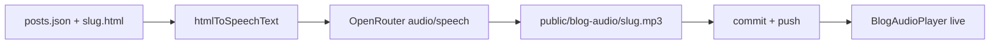

# WebWelle – Blog-Audio (Option B, lokal)

## Wann anwenden

- Nach neuem Git-Blogartikel ([`webwelle-blog-publish`](../webwelle-blog-publish/SKILL.md))
- Nutzer will **Artikel vorlesen** (Play-Button unter Titel)
- MP3 lokal auf Mac generieren, **nicht** im Docker/Coolify-Build

## Architektur

| Ebene | Pfad / Code | Rolle |
|-------|-------------|--------|
| **Sprechtext** | `src/lib/blog-html-to-speech-text.ts` | HTML → Plain Text (kein TTS von Tags) |
| **Generator** | `scripts/generate-blog-audio.ts` | Lokal: OpenRouter TTS → MP3 |
| **Audio-Datei** | `public/blog-audio/{slug}.mp3` | Committen + Push für Live |
| **Manifest** | `posts.json` → `audioUrl` | Player-Quelle |
| **Player** | `src/app/components/BlogAudioPlayer.tsx` | Unter Titel auf `/blog/[slug]` |
| **Temp** | `public/blog-audio/.tmp/` | **gitignored** |



**Wichtig:** Generierung läuft **nur lokal** (`npm run blog:audio`). Dockerfile und n8n rufen das Script **nicht** auf.

---

## Voraussetzungen (Mac)

1. `OPENROUTER_API_KEY` in `.env.local`
2. `ffmpeg` installiert: `brew install ffmpeg`
3. OpenRouter-Credits (ca. 0,05–0,30 € pro Artikel)

Optional in `.env.local`:

```
OPENROUTER_TTS_MODEL=sesame/csm-1b
OPENROUTER_TTS_VOICE=alloy
```

Verfügbare Modelle prüfen: `node scripts/list-openrouter-tts-models.mjs`  
TTS-Test: `node scripts/test-openrouter-tts.mjs sesame/csm-1b`

---

## Workflow

### 1. Artikel publishen (ohne Audio)

Wie [`webwelle-blog-publish`](../webwelle-blog-publish/SKILL.md): HTML + `posts.json` + Hero.

### 2. Sprechtext prüfen (dry-run)

```bash
npm run blog:audio -- --slug=mein-artikel-slug --dry-run
```

Prüfen: **keine** HTML-Tags (`<p>`, `h2`, `strong`) im Output — nur lesbarer Text.

### 3. MP3 generieren

```bash
# Ein Artikel
npm run blog:audio -- --slug=mein-artikel-slug

# Alle Git-Artikel in posts.json
npm run blog:audio -- --all
```

Das Script:
- liest Titel + Excerpt + HTML
- wandelt in Sprechtext um
- splittet in TTS-Chunks (~4.000 Zeichen)
- ruft `POST https://openrouter.ai/api/v1/audio/speech` auf
- concat mit ffmpeg → `public/blog-audio/{slug}.mp3`
- setzt `audioUrl` in `posts.json`

### 4. Lokal testen

```bash
npm run dev
```

`/blog/{slug}` — Play-Button unter Autor/Datum/Lesezeit.

### 5. Live schalten

```bash
git add public/blog-audio/{slug}.mp3 src/content/blog/posts.json
git commit -m "Blog-Audio: {slug}"
git push
```

MP3s werden wie Hero-Bilder mit deployt. **Temp-Ordner nicht committen.**

---

## posts.json — audioUrl

```json
{
  "slug": "mein-artikel",
  "audioUrl": "/blog-audio/mein-artikel.mp3",
  ...
}
```

Wird vom Script automatisch gesetzt. Player erscheint nur wenn `audioUrl` vorhanden.

---

## HTML → Sprechtext (Regeln)

| HTML | Sprechtext |
|------|------------|
| `title` + `excerpt` | Am Anfang, vor Body |
| `<h2>`, `<h3>` | Überschrift + Pause |
| `<p>` | Absatz |
| `<ol>` | Erstens, Zweitens, … |
| `<ul>` | Punkt eins, Punkt zwei, … |
| `<table>` | Zeilen: „Zelle1: Zelle2: …“ |
| `<a>` | Nur Link-Text |
| `<strong>` | Nur Wort |

OpenRouter bekommt **niemals** rohes HTML.

---

## Häufige Fehler

| Fehler | Ursache | Lösung |
|--------|---------|--------|
| `OPENROUTER_API_KEY fehlt` | Kein Key in `.env.local` | Key setzen |
| HTTP 402 | Credits/Key-Limit | Credits aufladen unter https://openrouter.ai/settings/credits — Script setzt bei erneutem Lauf fort (vorhandene Chunks in `.tmp/` werden übersprungen) |
| `ffmpeg nicht gefunden` | Nicht installiert | `brew install ffmpeg` |
| Player fehlt live | MP3 nicht gepusht | `audioUrl` + MP3 committen |
| Stimme liest „h zwei“ | HTML direkt an TTS | `--dry-run` prüfen, `htmlToSpeechText` nutzen |
| Chunk-Fehler | Text zu lang | Script splittet automatisch; ggf. Absätze kürzen |

---

## Kosten

- Pro Artikel (~2.000 Wörter): ca. **0,05–0,30 €** OpenRouter-Credits (einmalig)
- Pro Play-Klick auf Live-Seite: **0 €** (statische MP3)

---

## Code-Referenzen

| Datei | Zweck |
|-------|--------|
| `src/lib/blog-html-to-speech-text.ts` | HTML → Sprechtext + Chunk-Split |
| `scripts/generate-blog-audio.ts` | Lokales Generierungs-Script |
| `src/app/components/BlogAudioPlayer.tsx` | Play-UI |
| `src/app/blog/[slug]/page.tsx` | Player-Einbindung |
| `src/lib/blog-git-posts.ts` | `audioUrl` aus Manifest |
| `.gitignore` | `public/blog-audio/.tmp/` |

---

## Abgrenzung

| Thema | Weg |
|-------|-----|
| Artikel schreiben/publishen | `webwelle-blog-publish` |
| TTS im Deploy/n8n | **Nicht** — nur lokales Script |
| Live-TTS pro Klick | **Nicht** — Option B (vorab MP3) |
